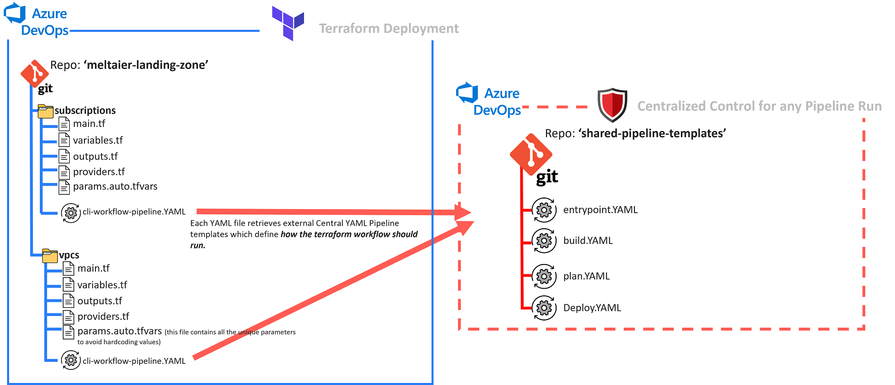
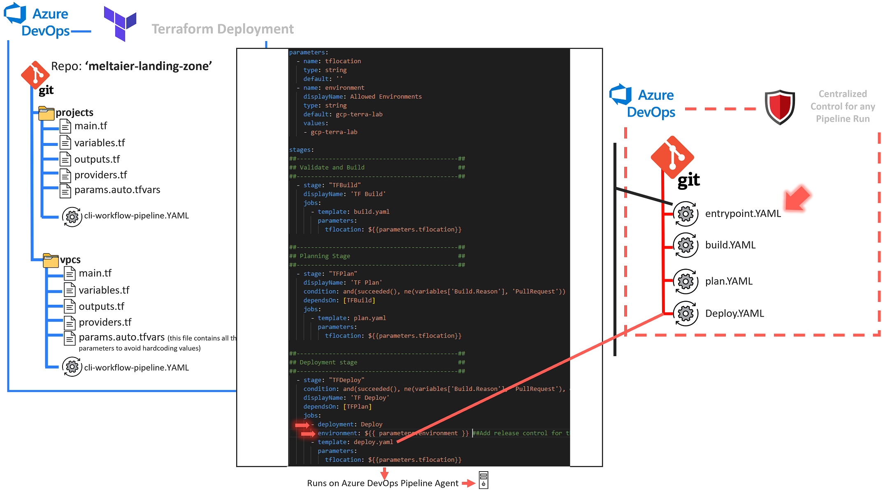
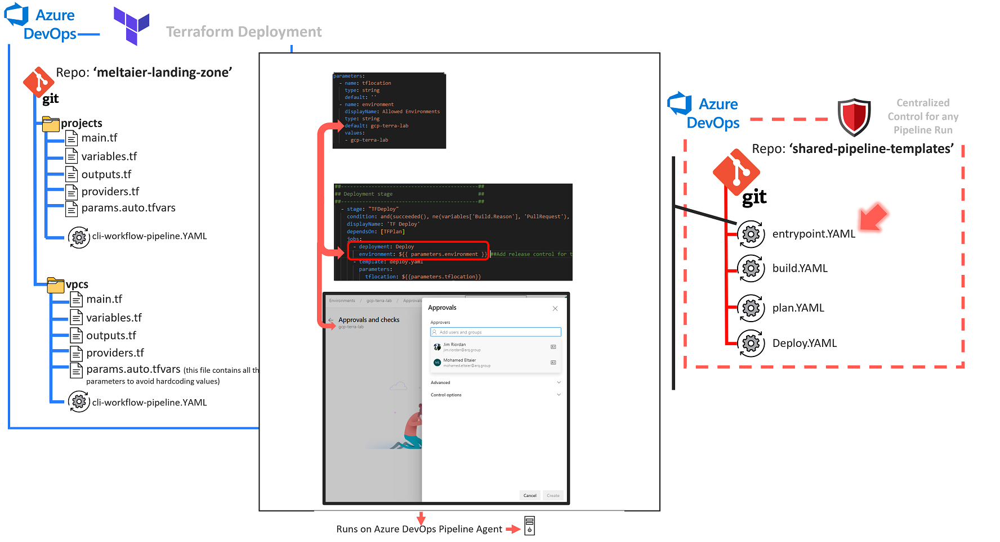

 # About
This repo hosts the shared pipeline templates that can be referenced from other YAML files, see the below repo for full examples:
https://github.com/moho4610/az-hcp-tfc-vault

## Typical Repo Configuration for a Terraform Deployment using Shared Pipeline Templates

## Change Control Configuration (Approvers)

